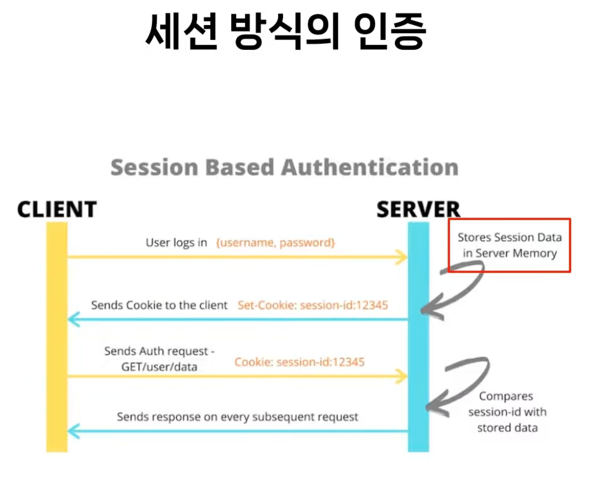
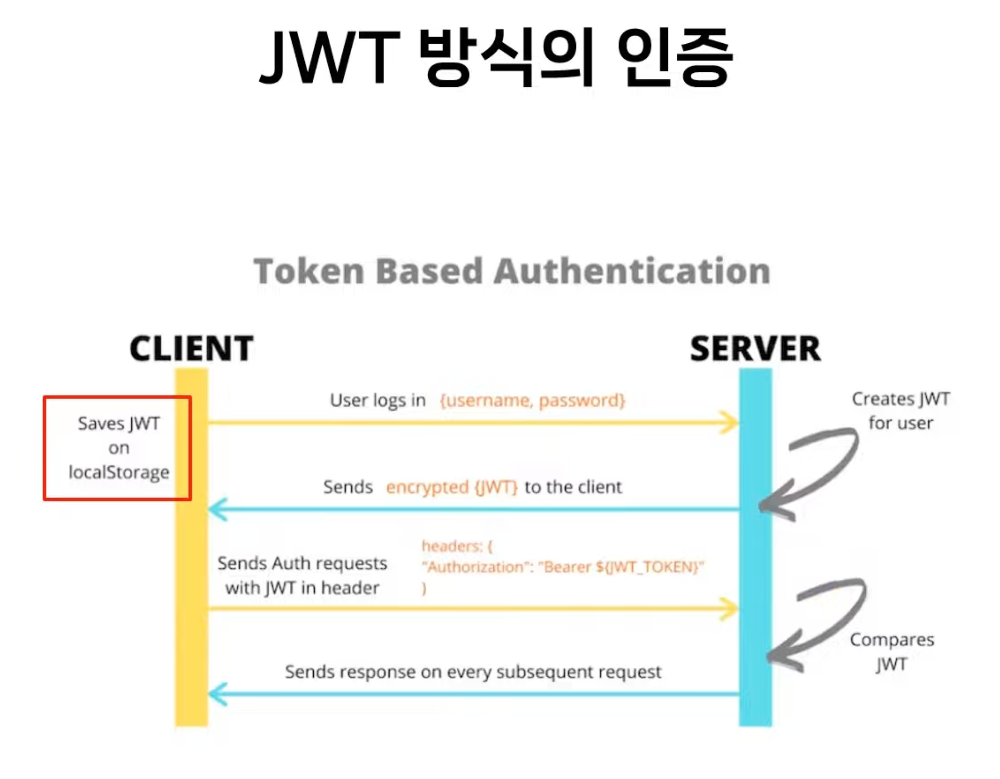
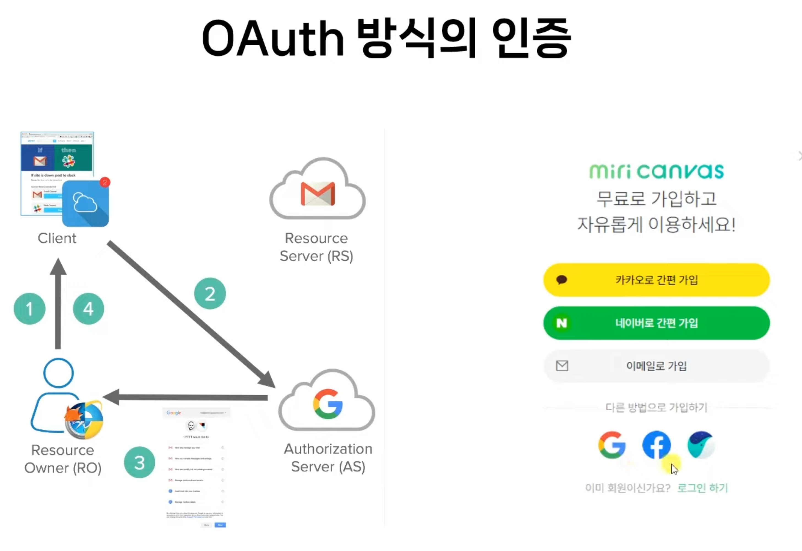
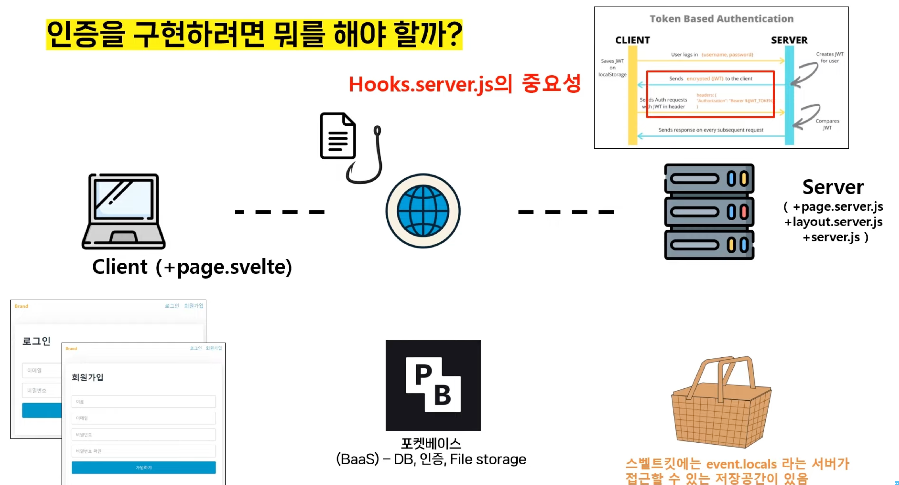

# 포켓베이스와 스벨트킷으로 인증 서비스 구현









## Pocketbase 설치
https://pocketbase.io/docs/

Pocketbase 실행
```bash
$ ./pocketbase serve
2023/10/30 13:30:20 Server started at http://127.0.0.1:8090
├─ REST API: http://127.0.0.1:8090/api/
└─ Admin UI: http://127.0.0.1:8090/_/
```

## SvelteKit 프로젝트 생성

SvelteKit 프로젝트 생성
```bash
$ npm create svelte@latest app
$ cd app
$ npm install
```

SvelteKit 프로젝트 실행
```bash
$ npm run dev
```

## Picocss 설정
https://picocss.com/docs/

app.html에 추가
```html
<**link** _rel_="stylesheet" _href_="https://cdn.jsdelivr.net/npm/@picocss/pico@1/css/pico.min.css">
```

## nav layout 추가
https://picocss.com/docs/navs.html


## Pocketbase Instance 생성

pocketbase npm 패키지 설치
https://github.com/pocketbase/js-sdk#nodejs-via-npm
```bash
$ npm install pocketbase --save
```

pocketbase 사용 설정
https://github.com/pocketbase/js-sdk#usage

### VS Code 플러그인 설치
- [Sveltekit Extension Pack](https://marketplace.visualstudio.com/items?itemName=ZimbronApps.sveltekit-extension-pack)
- [kit-snippets](https://marketplace.visualstudio.com/items?itemName=ArielSalgado.kit-snippets)
- [Auto Import - ES6, TS, JSX, TSX](https://marketplace.visualstudio.com/items?itemName=NuclleaR.vscode-extension-auto-import)
- [svelte](https://marketplace.visualstudio.com/items?itemName=1YiB.svelte-bundle)
- [Svelte Auto Import](https://marketplace.visualstudio.com/items?itemName=pivaszbs.svelte-autoimport)
- [Material Icon Theme](https://marketplace.visualstudio.com/items?itemName=PKief.material-icon-theme)


## Hook
- https://github.com/pocketbase/js-sdk#auth-store
- https://github.com/pocketbase/js-sdk#ssr-integration

Pocketbase auth-store 사용


## 회원가입 구현

form에 action을 설정하지 않으면 `+page.server.js`의 default action으로 처리됨

테스트 데이터
- name: 강해린
- email: cat@example.com
- password: 11112222
- passwordConfirm: 11112222
